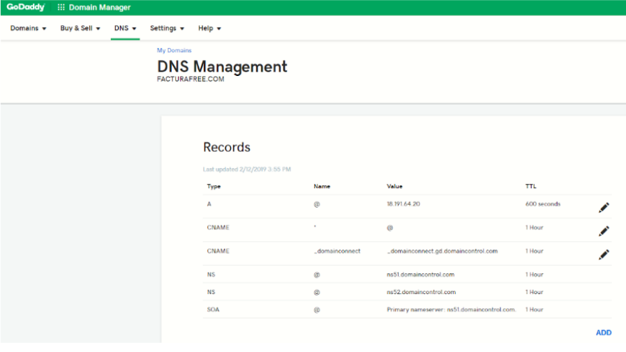
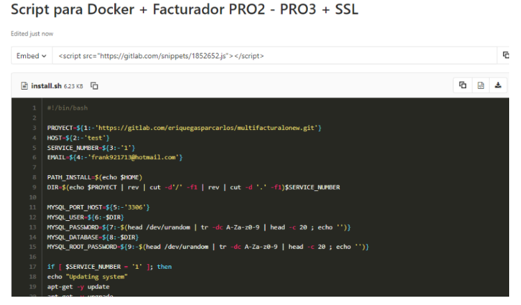
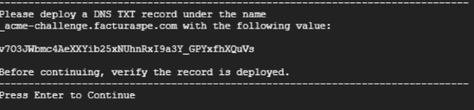

# Manual de Instalacion
<!--<h1>Manual de instalacion</h1> -->

## Descripcion 
Hemos elaborado un script para uso en instancias Linux, este es un archivo .sh que actualiza el sistema, instala las herramientas, sus dependencias, configura un certificado SSL renovable cada 90 días que debe ser confirmado en el proceso con su dominio y realiza todas las configuraciones previas, dejando el aplicativo listo para probar en menos de 20 minutos , su ejecución es muy sencilla.

### Requisitos previos
Tener acceso a su servidor, vps, máquina virtual o local via SSH, en las instalaciones que realizamos para AWS o Google Cloud, hacemos entrega del usuario, la IP del servidor y la clave ssh que puede ser un archivo .ppk o .pem.

Tener instalado una versión de ssh en su máquina para conectarse de manera remota, puede utilizar putty, filezilla o una consola terminal.

Es importante configurar su dominio apuntando a la IP de su instancia para que durante la ejecución del script se valide el certificado SSL y al finalizar la ejecución no tenga errores y todo esté listo para realizar pruebas. Edite los récords A y CNAME donde A debe contener su IP y CNAME el valor * (asterisco) para que se tomen los subdominios registrados por la herramienta.

4.Durante la ejecución del script deberá almacenar en su dominio dos registros TXT con unos valores que se mostrarán en pantalla, estos registros son validados en directo y no pueden tardar más de 2 minutos en validarse en su dominio.

5. En caso de contar con servicios instalados en su instancia como mysql, apache o nginx, debe detenerlos, ya que estos ocupan los puertos que pasarán a usarse con el aplicativo y los contenedores de Docker.

### Pasos

1. Acceder a su instancia vía SSH.

2. Loguearse como super usuario ejecute
~~~
sudo su
~~~
3. Ubicarse en la carpeta del usuario, por ejemplo
~~~
cd /home/ubuntu/
~~~
4.Crear el archivo install ejecute
~~~
touch install.sh
~~~
5. Editar el archivo con su editor preferido ejecute
~~~
nano install.sh
~~~
6. En el archivo debe agregar el contenido del siguiente enlace: https://gitlab.com/snippets/1852652

7 .Para salir de editor y guardar puede presionar “ctrl + x” seguidamente se le consultará si desea guardar los cambios, confirme con “y” y luego “enter”.

8. Debe darle permisos de ejecución al archivo: ejecute
~~~
chmod +x install.sh
~~~
9. El comando a utilizar requiere de dos parámetros principalmente:
` ./install.sh [repositorio] [dominio] `

por ejemplo:
~~~
./install.sh https://gitlab.com/rash07/facturadorpro2 elfacturador.com
~~~
10. Una vez ejecutado el comando se iniciará un proceso donde debe ir aceptando las preguntas y que le mostrará en pantalla los valores que debe añadir en los 2 récords tipo TXT de su dominio con nombre a. *_acme-challenge.example.com b. _acme-challenge* (casos como godday y puntope) en la siguiente imagen le muestran el valor como v703JW.... debera copiarlo y añadirlo al primer record TXT, seguidamente pulsar enter, se le mostrará en pantalla un segundo valor para el segundo TXT.

